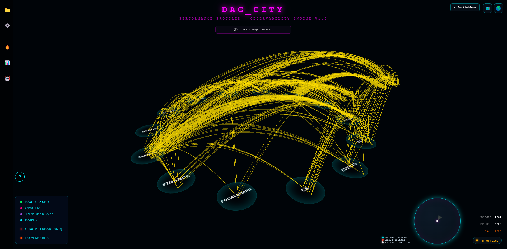
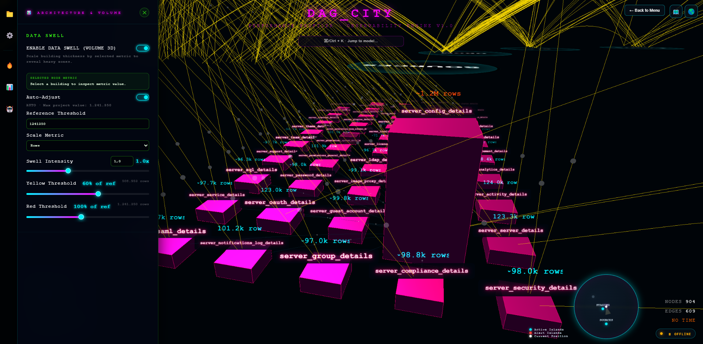
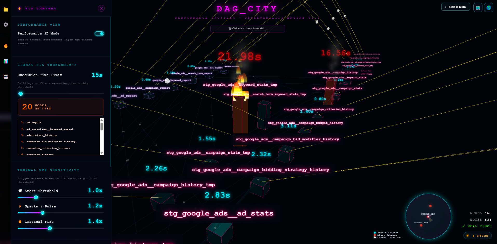
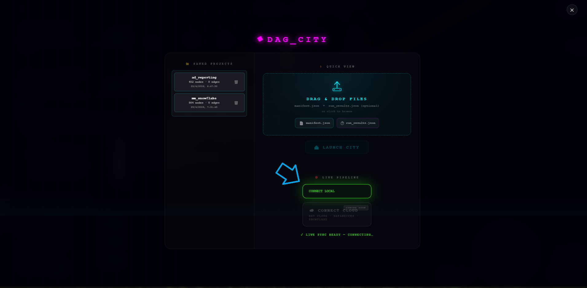
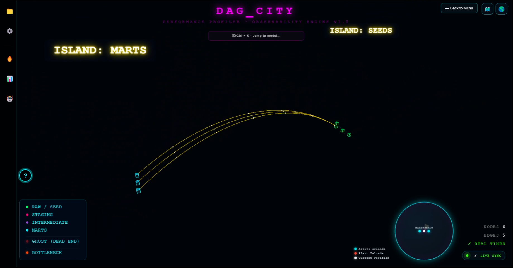
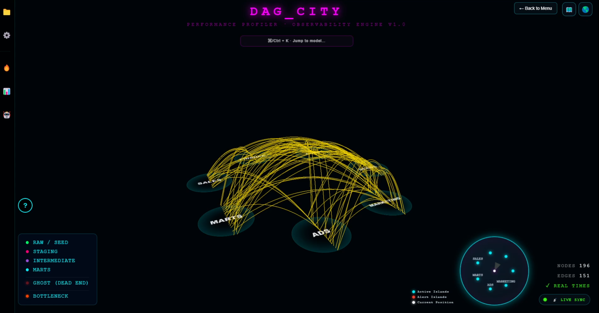
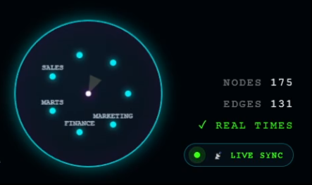
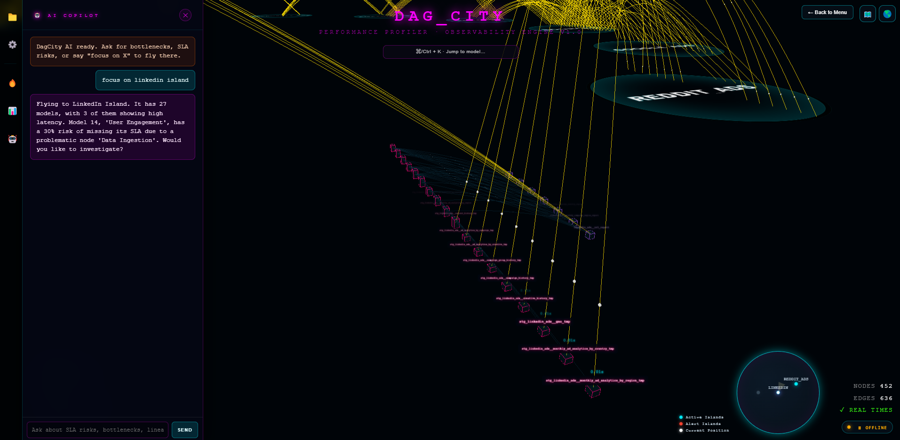

<div align="center">

# 🏙️ DAG CITY


**Transform your dbt DAG into a living, breathing 3D metropolis.**  
*Volume Analytics · SLA Violation Detection · Live Sync Protocol · Data Mesh Archipelago*

---

<!-- SCREENSHOT 1: Full city overview — aerial view of the 3D city with multiple islands, glowing neon buildings and inter-island arcs. Capture this from a high orbit angle showing the entire DAG City layout with all sectors visible. -->


*A DAG of 200+ dbt models rendered as a neon-lit metropolis. Each building is a node. Each glowing arc is a dependency.*

</div>

---

## 🧠 The Concept

Most data teams navigate their dbt lineage through flat YAML files or 2D network graphs. DAG City takes a radically different approach: it compiles your `manifest.json` into a **fully interactive 3D city**, where the skyline encodes your pipeline's performance at a glance.

> **No more invisible bottlenecks.** If a model is slow, its building is tall and on fire.  
> **No more lost lineage.** Every dependency is an arc of light connecting two buildings.  
> **No more stale dashboards.** The city rebuilds itself the moment your dbt run finishes.

---

## ✦ Feature Matrix

| System | What It Does |
|---|---|
| **Volume Analytics** | Building height and width encode execution time, row count, or SQL complexity |
| **SLA Violations / Performance 3D** | Nodes exceeding latency thresholds emit smoke → sparks → fire in real-time |
| **Live Sync Protocol** | Docker volume watcher + SSE stream rebuilds the city on every `dbt run` |
| **Data Mesh Archipelago** | Multi-project DAGs render as isolated islands with inter-island arcs |
| **Ghost Protocol / Focus Mode** | Vantablack isolation of upstream/downstream lineage paths |
| **Tactical Radar HUD** | Local minimap + Global Tactical Map overlay for navigation |
| **Cinema Mode** | Press `V` for a clean, full-screen cinematic rendering of the city |
| **AI Copilot** | Embedded chat (OpenAI / Groq) with DAG context injection and `FOCUS_NODE` action |
| **2D Schematic Mode** | Toggle to a flat network diagram with cluster expansion |
| **Multi-Project Manager** | Persist, switch, and compare multiple dbt projects in a single instance |

---

## 🏙️ Volume Analytics

> *"The skyline doesn't lie."*

Every building in DAG City is a **direct physical encoding of your pipeline's data.**

```
Building HEIGHT  = f(execution_time)  ← pulled directly from run_results.json
Building WIDTH   = f(row_count | sql_length | connections)  — Data Swell mode
Building COLOR   = dbt layer (source, staging, intermediate, mart, consumption)
```

> **`run_results.json` is the fuel for the skyline.** Without it, all buildings render as a flat base-plate city (honest — no synthetic data). Drop it alongside `manifest.json` and every model's real wall-clock execution time is encoded into its geometry.

### How `run_results.json` is ingested

The parser reads every `execution_time` field from the `results` array and indexes it by `unique_id`:

```python
# src/core/parser.py
for result in run_results.get("results", []):
    uid = result.get("unique_id", "")
    t   = result.get("execution_time", 0.0)
    if uid:
        run_times[uid] = round(float(t), 3)
```

The parser then cross-references each node against `run_times`. If a match exists, `time_source` is marked `"real"`; otherwise `"none"` — and the building stays flat. No guessing, no synthetic padding.

**Both paths work seamlessly:**

| Files provided | Result |
|---|---|
| `manifest.json` only | City renders — all buildings flat (base-plate aesthetic) |
| `manifest.json` + `run_results.json` | Full Volume Analytics — heights, bottleneck detection, thermal VFX |

Height is computed using a **logarithmic scale** with a gamma-corrected, blended weight system that prevents extreme outliers from compressing the rest of the skyline. When a model produces 100M+ rows, its building becomes a skyscraper. When it runs in under a second, it stays a flat base plate.

**Data Swell Metrics (selectable in the SLA Panel):**

| Metric | Encoding |
|---|---|
| `rows` | Direct row count from `manifest.json` stats/meta, with heuristic fallback |
| `execution_time` | Wall-clock time from `run_results.json` |
| `code_length` | SQL/Jinja source length |
| `connections` | Degree (upstream + downstream count) |
| `uniform` | Honest flat base-plate (no data = no height) |

> **Design principle:** Synthetic data is prohibited by default. If `run_results.json` is absent, all buildings render flat. A dev-only console hook (`window.enableMarketingMode()`) exists for demo purposes only and never leaks into production builds.

---

<!-- SCREENSHOT 2: Volume Analytics / Data Swell — close-up of a sector with varying building heights, showing tall skyscrapers for slow/heavy nodes next to short buildings. Capture with the SLA panel open showing the fire count badge and the slider controls. -->
<div align="center">

</div>

---

## 🔥 Performance 3D & SLA Violations

DAG City's thermal VFX system is a **three-stage escalation engine** tied to a configurable SLA ratio:

```
ratio = node.execution_time / sla_threshold

ratio ≥ 1.0  →  💨  Smoke particles rise from the rooftop
ratio ≥ 1.2  →  ⚡  Electric sparks + emissive pulse on the building material
ratio ≥ 1.5  →  🔥  Fire sprites engulf the structure — node is BURNING
```

SLA thresholds are configurable at **three granularity levels**, all persisted per-project in `localStorage`:

1. **Global SLA** — default baseline for all nodes (editable inline, default: 120s)
2. **Zone SLA** — per-layer overrides (`source`, `staging`, `intermediate`, `mart`)
3. **Node SLA** — surgical per-model overrides with fuzzy-search selector

The bottleneck detection engine runs server-side in `parser.py` using a **statistical outlier algorithm** (Mean + 1.5 × StdDev), flagging the top performers before the graph even reaches the browser.

```python
# src/core/parser.py — Phase 3: Statistical Bottleneck Flagging
threshold = mean_time + (1.5 * stdev_time)
node["is_bottleneck"] = node["execution_time"] > threshold and node["execution_time"] > 0
```

VFX is gated by `State.perfMode` and `State.showParticles` — zero overhead when Performance Mode is off.

---

<!-- SCREENSHOT 3: SLA Fire Violations — a cluster of buildings burning with smoke and fire particles. The SLA panel should be open on the left showing the fire count badge (e.g., "3 NODES ON FIRE") and the threshold sliders. Ideally capture during a live dbt run so nodes are actively transitioning. -->
<div align="center">

</div>

---

## 🌐 Data Mesh Archipelago & Sector Mapping

For multi-package or multi-project architectures, DAG City renders each logical domain as a **separate island** floating in the void.

### Island Grouping — Hybrid Rules Engine

The `ManifestParser` classifies every node into an island using a **priority-ordered rules engine:**

```
Rule 0 → Mart nodes          → Island: "MARTS"
Rule 1 → Sources / Seeds     → Island: "SOURCES" / "SEEDS"
Rule 2 → External packages   → Island: package_name.upper()  (e.g., "JAFFLE_ENTERPRISE")
Rule 3 → Monolith folders    → Island: fqn[1].upper() or models/ subfolder
Rule 4 → Fallback            → Island: "CORE"
```

Cross-island data flows render as **high-altitude Massive Aerial Arches** — Bezier curves that peak at `Y = max(400, dist × 0.35)` — making cross-domain dependencies visible at any zoom level.

Island transitions trigger camera tweens (1500ms ease-in-out-cubic) with automatic framing based on island radius. Navigation is available via:

- **Radar HUD** — local minimap showing nearby islands within 3000 world units
- **Global Tactical Map** (`M` key) — full-world overhead map with click-to-fast-travel
- **Island Jump Panel** — sidebar list of all sectors with one-click flyover
- **Omni Search** (`⌘K` / `Ctrl+K`) — fuzzy-search across all nodes

```
┌─────────────┐     Aerial Arc     ┌──────────────────────┐
│  SOURCES    │ ──────────────────▶ │  JAFFLE_ENTERPRISE   │
│  (island)   │                    │  (island)            │
└─────────────┘                    └──────────────────────┘
```

---

## 📡 Live Sync Protocol

The Live Sync Protocol is a **zero-configuration, file-system-event-driven** real-time update pipeline:

```
dbt run / dbt compile
      │
      ▼
  manifest.json updated on disk
      │
      ▼
  ManifestWatcher (watchdog PollingObserver, 1s interval, debounced 500ms)
      │
      ▼
  FastAPI SSE endpoint /api/live-stream broadcasts {type: "update", project: "..."}
      │
      ▼
  Browser EventSource receives message → _applyLiveUpdateWithRetry()
      │
      ▼
  rebuildCity(data, isLive=true) → Three.js scene updates in-place
```

**Key design decisions:**
- `PollingObserver` (not `inotify`) ensures cross-platform compatibility inside Docker on macOS/Windows hosts
- Debounce (500ms) prevents partial-read race conditions during large manifest writes
- Client-side retry logic (up to 4 attempts, exponential backoff starting at 700ms) handles transient HTTP errors during heavy dbt runs
- SSE reconnects automatically after 5s on connection loss

### One-Click Live Connect

```bash
# Mount your dbt project and start DagCity — it finds the manifest automatically
HOST_PROJECT_PATH=/path/to/your/dbt_project docker compose up
```

The server-side `autodiscover_manifest()` function performs a deep search of `/data` on startup. The UI polls `/api/check-local` and enables the **CONNECT LOCAL** button when a live manifest is detected. No manual path configuration required.

---

## 🗂️ Architecture

```
DagCity/
├── src/
│   ├── main.py                  # FastAPI app — routes, startup orchestration, SSE bridge
│   ├── core/
│   │   ├── config.py            # Env-aware config + manifest autodiscovery
│   │   ├── parser.py            # ManifestParser — 5-phase DAG extraction engine
│   │   ├── generator.py         # VizGenerator — HTML shell with injected graph data
│   │   ├── watcher.py           # ManifestWatcher — watchdog + asyncio bridge
│   │   ├── streamer.py          # SSE router — /api/live-stream
│   │   └── router_projects.py   # Project CRUD — persist/load/delete
│   └── static/js/
│       ├── CityEngine.js        # Three.js scene — buildings, arcs, VFX, camera, LOD, DRS
│       ├── UIManager.js         # All UI panels — SLA, Settings, Architecture, AI chat
│       ├── DataManager.js       # Fetch, SSE client, drag-drop upload, Live Sync connect
│       ├── VFXManager.js        # Particle systems — smoke, sparks, fire sprites
│       ├── State.js             # Reactive singleton — pub/sub, project-scoped localStorage
│       ├── AIClient.js          # OpenAI / Groq integration with DAG context injection
│       ├── DashboardManager.js  # Landing screen, project manager modal
│       ├── Visualizer.js        # Three.js scene init, bloom post-processing
│       ├── StorageManager.js    # SLA persistence, project metadata
│       └── DAGView2D.js         # 2D schematic overlay renderer
├── Dockerfile                   # python:3.12-slim, uvicorn entrypoint
├── docker-compose.yml           # Volume-aware compose with HOST_PROJECT_PATH
└── requirements.txt             # fastapi · uvicorn · watchdog · sse-starlette
```

### Rendering Pipeline

```
CityEngine.js (Three.js r134)
  │
  ├── Geometries:    BoxGeometry per node, QuadraticBezierCurve3 per link
  ├── Materials:     MeshStandardMaterial (array) — top/side colors per layer
  ├── Post-FX:       UnrealBloomPass (selective bloom via layers)
  ├── Labels:        CSS2DRenderer — floating data volume labels
  ├── VFX:           VFXManager — particle groups per bottleneck node
  ├── LOD:           Near (full geo) / Medium / Far (billboard imposters) / Monolith
  ├── DRS:           Dynamic Resolution Scaling — 4-step FPS-adaptive degradation
  └── Culling:       Frustum + distance culling per island, every 10 frames
```

---

## 🚀 Quick Start

### Option A — Docker (Recommended)

```bash
# Clone
git clone https://github.com/your-username/DagCity.git
cd DagCity

# Point at your dbt project and launch
HOST_PROJECT_PATH=/path/to/your/dbt_project docker compose up --build
```

Open **http://localhost:8080** and click **CONNECT LOCAL**.  
Run `dbt run` in another terminal — the city rebuilds automatically.

### Option B — Offline Upload

1. Generate your dbt artifacts:
   ```bash
   dbt compile   # produces target/manifest.json
   dbt run       # produces target/run_results.json  ← required for building heights & fire VFX
   ```
2. Open **http://localhost:8080**
3. Drag & drop **both files** onto the **LAUNCH ZONE** — the city renders in seconds.

> You can drop either file independently. `manifest.json` alone gives you the full topology. Add `run_results.json` and the skyline comes alive with real performance data.

**Where to find the files after `dbt run`:**
```
your_dbt_project/
└── target/
    ├── manifest.json       ← DAG topology, columns, descriptions, layer info
    └── run_results.json    ← Execution times per model (the skyline fuel)
```

### Option C — Local Development

```bash
pip install -r requirements.txt
cd src
uvicorn main:app --host 0.0.0.0 --port 8080 --reload
```

---

## ⌨️ Keyboard Shortcuts

| Key | Action |
|---|---|
| `G` | Global View — cinematic orbit of the entire city |
| `M` | Global Tactical Map overlay |
| `V` | Cinema Mode — hide all UI for clean recording |
| `Esc` | Deselect / close panels |
| `⌘K` / `Ctrl+K` | Omni Search — find any node instantly |
| `Click` node | Focus + lineage highlight |
| `Double-click` node | Full upstream/downstream blast radius |

---

<!-- SCREENSHOT 4A: Terminal showing "dbt run" output with manifest.json and run_results.json being written. -->
<div align="center">

</div>

<!-- SCREENSHOT 4B: DagCity browser showing the city with the LIVE SYNC indicator active in the HUD (top-right badge reads "LIVE SYNC ACTIVE"). -->
<div align="center">

</div>

<div align="center">

</div>

<!-- SCREENSHOT 4C: Close-up of the sync status badge showing "LIVE SYNC ACTIVE" and the city rebuilding in real-time. -->
<div align="center">

</div>

---

## 🤖 AI Copilot

The embedded AI panel connects to **OpenAI (gpt-4o-mini)** or **Groq (llama-3.3-70b-versatile)** with a DAG-aware context prompt that includes:

- Nodes currently violating SLA thresholds (with execution times)
- Dead-end nodes (staging/intermediate with no consumers — Ghost Protocol audit)
- Heavy nodes by active Data Swell metric
- Island count and total model count
- Currently selected node

The assistant responds with a structured JSON payload:

```json
{
  "message": "The model fct_orders is your primary bottleneck at 187s, 1.56× your SLA.",
  "action": "FOCUS_NODE",
  "target": "fct_orders"
}
```

When `action: FOCUS_NODE`, the UI automatically flies the camera to the target node and activates its lineage highlight — turning the AI into a **navigational co-pilot**.

API keys are stored in `localStorage` only. No server-side key handling.

<!-- SCREENSHOT 5: AI Copilot — showing the AI chat panel open on the right with a conversation about a bottleneck node, and the JSON response with FOCUS_NODE action. The DAG context should be visible in the prompt preview. -->
<div align="center">

</div>

---

## 🧬 Parser Engine — 5-Phase DAG Extraction

`ManifestParser` processes `manifest.json` + optional `run_results.json` in five sequential phases:

| Phase | Operation |
|---|---|
| **1. Extraction** | Parse all `nodes` + `sources`, apply layer classification rules engine |
| **2. Link Building** | Traverse `depends_on.nodes` to build directed edges, populate upstream/downstream arrays |
| **3. Bottleneck Flagging** | Statistical outlier detection: `mean + 1.5σ` threshold |
| **4. Topological Catch-All** | Reclassify `unclassified` nodes by graph topology (leaf = mart, interior = intermediate) |
| **5. Group Reassignment** | Promote topology-resolved mart nodes to `"MARTS"` island after phase 4 |

Layer color palette (server-assigned, browser-consistent):

```python
"source":       "#00ff66"   # Green  — raw data
"staging":      "#ff0077"   # Pink   — stg_ models
"intermediate": "#9d4edd"   # Purple — int_ models
"mart":         "#00f2ff"   # Cyan   — fct_ / dim_
"consumption":  "#ffd700"   # Gold   — exposures / metrics
```

---

## ⚙️ Environment Variables

| Variable | Default | Description |
|---|---|---|
| `HOST_PROJECT_PATH` | `./data` | Host path mounted to `/data` in container |
| `MANIFEST_SUBPATH` | `target/manifest.json` | Relative path within the mounted volume |
| `PORT` | `8080` | Server port |
| `PROJECTS_DIR` | `/app/projects` | Internal project persistence directory |

---

## 🧱 Tech Stack

| Layer | Technology |
|---|---|
| **3D Engine** | Three.js r134 — WebGL renderer, bloom post-processing, CSS2DRenderer |
| **Backend** | FastAPI + Uvicorn — async REST + SSE streaming |
| **File Watching** | watchdog 4.0 — PollingObserver with asyncio bridge |
| **Containerization** | Docker (python:3.12-slim) + Compose v2 |
| **State Management** | Vanilla JS reactive singleton — project-scoped localStorage |
| **AI Integration** | OpenAI / Groq REST API — structured JSON response format |

---

## 📋 Roadmap

- [ ] dbt Cloud API integration (no local manifest required)
- [ ] Time-travel mode — replay historical `run_results.json` as city animation
- [ ] Slack / Mattermost alert routing for SLA breach events
- [ ] Prometheus metrics export endpoint
- [ ] WebGL2 instanced rendering for 10,000+ node DAGs

---

## 📄 License

MIT — see [LICENSE](LICENSE)

---

<div align="center">

Built for data engineers who refuse to navigate complexity in two dimensions.

**🏙️ DAG CITY — Where infrastructure meets art.**

</div>